# RSIP-tree

RSIP 的洞察是自由意志和随机过程的概率值的斗争，当某个选项的概率远大于其他选项时，自制力就已经基本无效了。核心思想：

1. 回溯到理性能够控制的原始节点。越靠近根部的节点越稳固。
2. 用DAG管理节点间的依赖关系，节点失败后，其所有子节点全部跟着失败。建立依赖关系时不要有太大心理负担、不用担心是否合理，让实践来检验是否合理，执行失败了再慢慢重建就是。

rule of thumb：
1. 直接子节点的个数不要太多，以免变得太宽太矮，失去约束效果。
2. 1天最多点亮1个节点。养成好习惯不急于求成。
3. 某节点失败后，其子节点中没有跟着失败的部分，重建时再考虑与该节点并列。
4. 某节点反复失败的话，可能现在还没到插入这个节点的时机。

可以用所谓 链式时延协议（Chained Time-Delay Protocol, CTDP）解决短期拖延症。CTDP的洞察是将效用建模为(价值*权重)关于时延的积分，从而能够通过一些思想实验变换函数图像，让中长期更有价值的任务得到人脑的认可。核心思想：

1. 预约机制。人脑对短期收益过分看重（双曲贴现），因此即使是把决策和执行稍微错开一点时间也会对自制力有巨大影响。
2. 判例法。下必为例。在当下和长远保持一致，破坏规则不只是打破一次，而是永远打破。

我可能相对不重视沉没成本，所以觉得 CTDP 中“任务链”部分没啥意义。而其中将时间段打包决策的“番茄工作法”只适用于工作时间。

```mermaid
graph TD

classDef failed stroke:#ff0000, stroke-width:3px, color:#ff0000, fill:#fff5f5, stroke-dasharray: 5

subgraph pre
  RSIP[每天检视RSIP图，并考虑是否要插入新节点]
  RSIP --> 手机不上床
  手机不上床 --> 站立使用[准备上床、刚下床的时间内，使用需断舍离的相关设备（手机、电脑 etc.）需保持站立]
end


pre --> 清晨和上午
subgraph 清晨和上午
  清晨洗漱[清晨洗漱：起床后，下床（、听歌）、洗漱、打水，在完成这些之前先什么消息都别看]
  清晨洗漱 --> 早饭[早饭：早上一定要吃早饭]
  早饭 --> 清晨看TODO[清晨检视和调度TODOs]
end


pre --> 中午和下午
subgraph 中午和下午
  午饭[午饭：若因拖延症而到12:40尚未吃午饭，当天不吃普通午饭]
  午饭 --> 午饭后洗漱[午饭后洗漱：洗漱、打水]
  class 午饭后洗漱 failed
  午饭后洗漱 --> 中午今日琐事[清空今日琐事（允许自由裁量）]
  class 中午今日琐事 failed
  中午今日琐事 --> 午休[午休：11:00~14:00内，刻意休息至少1分钟]
  class 午休 failed
  午休 --> 中午看TODO[中午检视和调度TODOs]
  class 中午看TODO failed
end
class 中午和下午 failed


pre --> 傍晚和晚上
subgraph 傍晚和晚上
  晚饭[晚饭：若因拖延症而到18:40尚未吃晚饭，当天不吃普通晚饭]
  晚饭 --> 晚饭后洗漱[晚饭后洗漱：洗漱、打水]
  class 晚饭后洗漱 failed
  晚饭后洗漱 --> 傍晚今日琐事[清空今日琐事（允许自由裁量）]
  class 傍晚今日琐事 failed
  傍晚今日琐事 --> 酉休[酉休：17:00~19:00内，刻意休息至少1分钟]
  class 酉休 failed
  酉休 --> 傍晚看TODO[傍晚检视和调度TODOs]
  class 傍晚看TODO failed
end
class 傍晚和晚上 failed

pre --> 深夜
subgraph 深夜
  深夜今日琐事[清空今日琐事（允许自由裁量）]
  class 深夜今日琐事 failed
  深夜今日琐事 --> 深夜洗漱
  subgraph 深夜洗漱
    深夜洗漱1级[深夜洗漱1级：23:05前]
    class 深夜洗漱1级 failed
    深夜洗漱1级 --> 深夜洗漱提醒[深夜洗漱提醒：22:22耳机闹钟（自动）]
    class 深夜洗漱提醒 failed
    深夜洗漱提醒 --> 深夜洗漱最高级[深夜洗漱：22:30前]
    class 深夜洗漱最高级 failed
  end
  class 深夜洗漱 failed
  深夜洗漱 --> 玩得尽兴[玩得尽兴：每天分出至少15分钟连续时间（目前默认时间是深夜洗漱后），刻意娱乐。放松做“多余的事”，想做啥做啥；禁止为所谓正事焦虑。若因故未能满足，则需尽快（1天内）制定初步调娱计划]
  class 玩得尽兴 failed

  玩得尽兴 --> 防熬夜而断舍离
  subgraph 防熬夜而断舍离
    subgraph 睡前电脑断舍离[睡前电脑断舍离：后若有需可改其他强提醒，以便深夜挂机下载等]
      睡前电脑关机1级[睡前电脑关机1级：24:05（自动）]
      class 睡前电脑关机1级 failed
    end
    class 睡前电脑断舍离 failed

    subgraph 睡前手机断舍离
      睡前手机断舍离强提醒[睡前手机断舍离强提醒：23:00颜色反转（自动）]
      class 睡前手机断舍离强提醒 failed
      睡前手机断舍离强提醒 --> 睡前手机准断舍离状态[睡前手机准断舍离状态：站立使用]
      class 睡前手机准断舍离状态 failed
      睡前手机断网[睡前手机断网：23:20（自动）]
      class 睡前手机断网 failed
    end
    class 睡前手机断舍离 failed
  end
  class 防熬夜而断舍离 failed
  防熬夜而断舍离 --> 早睡
  subgraph 早睡
    早睡1级[早睡1级：24:05]
    class 早睡1级 failed
  end
  class 早睡 failed
end
class 深夜 failed

深夜 --> post
subgraph post
end
```

