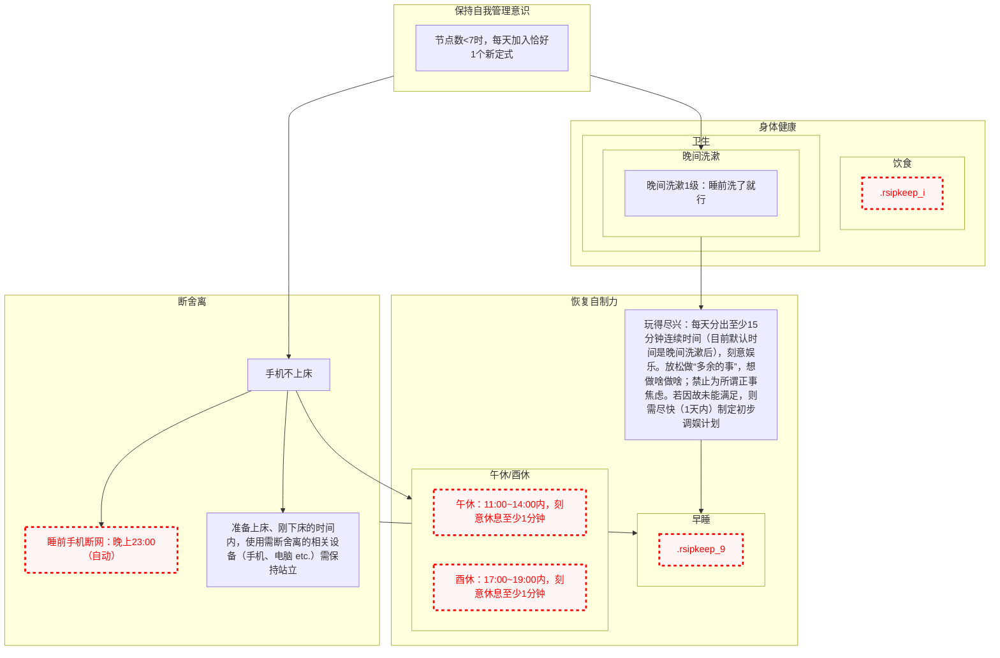

# RSIP-tree

> 自增ID 使用base36（26个小写字母+10个数字）编码。

插入定式时不要有太大心理负担，构建得不合理也是没事的，崩了就崩了，再慢慢重建就是。

节点执行失败的话，若不打算调整结构，可考虑只将其熄灭而不移除。但同样一天最多点亮一颗。

```mermaid
graph TD

classDef failed stroke:#ff0000, stroke-width:3px, color:#ff0000, fill:#fff5f5, stroke-dasharray: 5

subgraph 5[保持自我管理意识]
  0[节点数<7时，每天加入恰好1个新定式]
end
5 --> 1
5 --> 6

subgraph d[断舍离]
  1[手机不上床]
  1 --> e[睡前手机断网：晚上23:00（自动）]
  class e failed
  1 --> l[准备上床、刚下床的时间内，使用需断舍离的相关设备（手机、电脑 etc.）需保持站立]
end

subgraph g[身体健康]
  subgraph h[卫生]
    subgraph 6[晚间洗漱]
      b[晚间洗漱1级：睡前洗了就行]
    end
  end
  subgraph i[饮食]
    .rsipkeep_i
    class .rsipkeep_i failed
  end
end

1 --> 2
d --> 9
6 --> 8
subgraph f[恢复自制力]
  subgraph 2[午休/酉休]
    j[午休：11:00~14:00内，刻意休息至少1分钟]
    k[酉休：17:00~19:00内，刻意休息至少1分钟]
    class j failed
    class k failed
  end
  8[玩得尽兴：每天分出至少15分钟连续时间（目前默认时间是晚间洗漱后），刻意娱乐。放松做“多余的事”，想做啥做啥；禁止为所谓正事焦虑。若因故未能满足，则需尽快（1天内）制定初步调娱计划]
  8 --> 9
  subgraph 9[早睡]
    .rsipkeep_9
    class .rsipkeep_9 failed
  end
end
```
