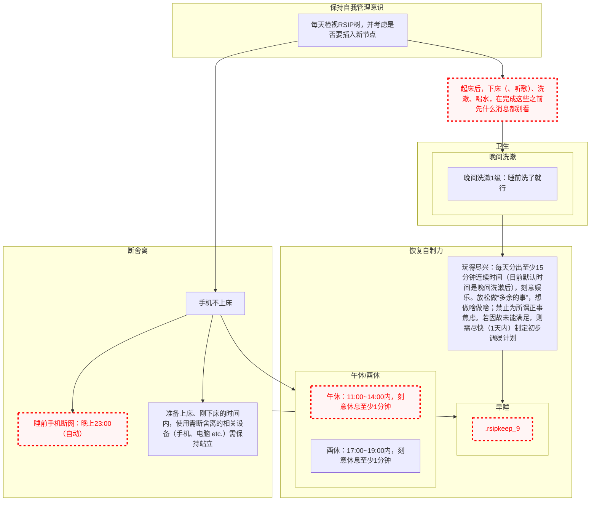

# RSIP-tree

新添加的节点为熄灭状态。1天最多点亮1个节点。

节点执行失败的话，可以只熄灭。但失败次数多了，可能要考虑调整树结构。

插入定式时不要有太大心理负担，构建得不合理也是没事的，崩了就崩了，再慢慢重建就是。

```mermaid
graph TD

classDef failed stroke:#ff0000, stroke-width:3px, color:#ff0000, fill:#fff5f5, stroke-dasharray: 5

subgraph 5[保持自我管理意识]
  0[每天检视RSIP树，并考虑是否要插入新节点]
end
0 --> 1
0 --> m

subgraph d[断舍离]
  1[手机不上床]
  1 --> e[睡前手机断网：晚上23:00（自动）]
  class e failed
  1 --> l[准备上床、刚下床的时间内，使用需断舍离的相关设备（手机、电脑 etc.）需保持站立]
end

m[起床后，下床（、听歌）、洗漱、喝水，在完成这些之前先什么消息都别看]
m --> 6
class m failed

subgraph h[卫生]
  subgraph 6[晚间洗漱]
    b[晚间洗漱1级：睡前洗了就行]
  end
end

1 --> 2
d --> 9
6 --> 8
subgraph f[恢复自制力]
  subgraph 2[午休/酉休]
    j[午休：11:00~14:00内，刻意休息至少1分钟]
    k[酉休：17:00~19:00内，刻意休息至少1分钟]
    class j failed
  end
  8[玩得尽兴：每天分出至少15分钟连续时间（目前默认时间是晚间洗漱后），刻意娱乐。放松做“多余的事”，想做啥做啥；禁止为所谓正事焦虑。若因故未能满足，则需尽快（1天内）制定初步调娱计划]
  8 --> 9
  subgraph 9[早睡]
    .rsipkeep_9
    class .rsipkeep_9 failed
  end
end
```
