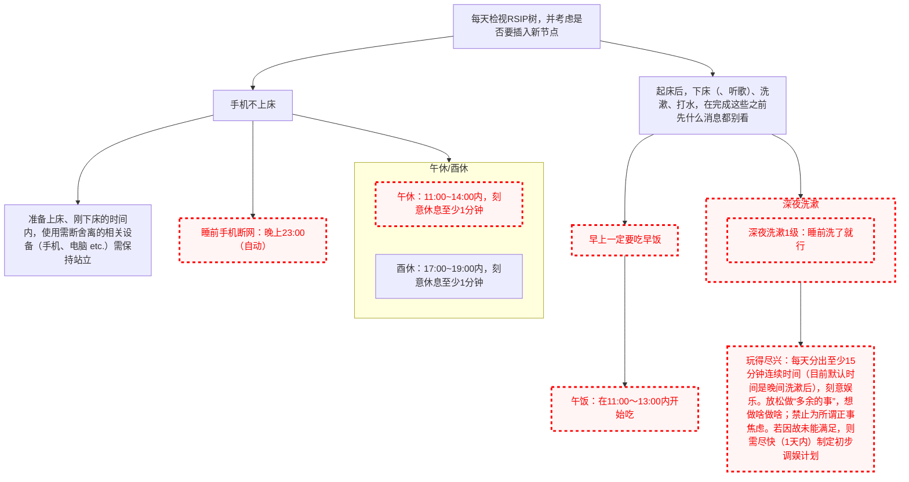

# RSIP-tree

新添加的节点为熄灭状态。1天最多点亮1个节点。

节点执行失败的话，可以只熄灭。但失败次数多了，可能要考虑调整树结构。

插入定式时不要有太大心理负担，构建得不合理也是没事的，崩了就崩了，再慢慢重建就是。

注意体会 RSIP 的核心思想：

1. 回溯到理性能够控制的原始节点。越靠近根部的节点越稳固。
2. 用树管理节点间的依赖关系。子节点个数不要太多，以免树变得太宽太矮、失效了。

